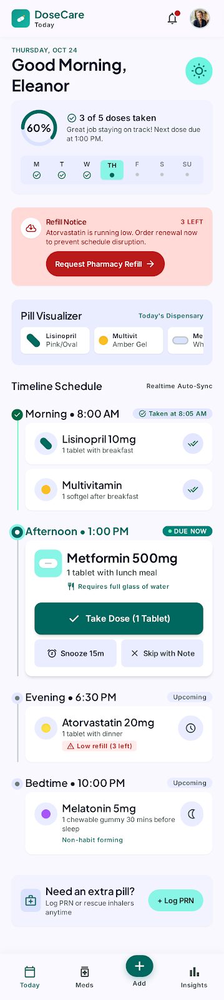
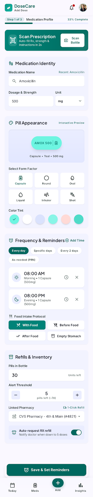
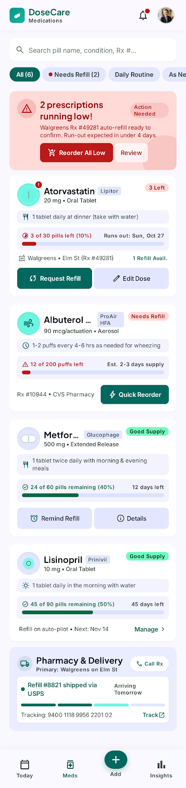
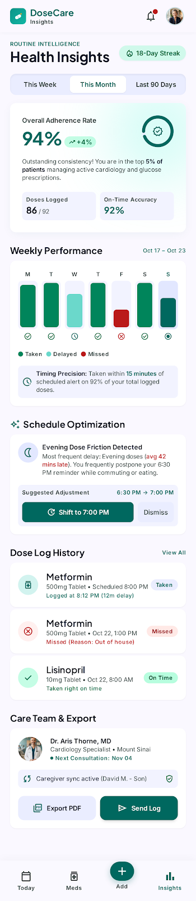
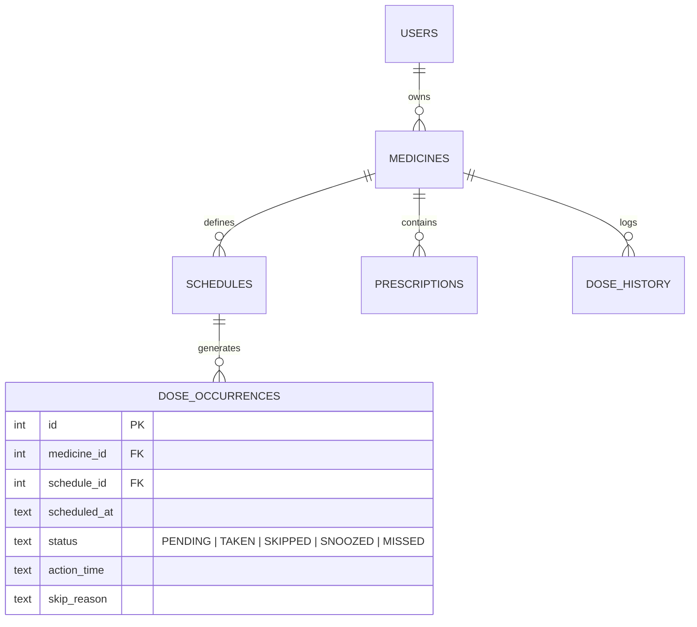

# 💊 DoseCare

[](https://flutter.dev)
[](https://dart.dev)
[](https://flutter.dev)
[](LICENSE)
[](https://github.com/roha301/DoseCare)

> **DoseCare** is a modern, offline-first personal medication companion and adherence tracker. Engineered with a stress-free clinical design system, transactional inventory safeguards, and an immutable schedule occurrence engine, DoseCare empowers patients and caregivers to manage chronic prescriptions safely and effortlessly.

---

## 📖 Table of Contents

- [Project Overview](#-project-overview)
- [Project History & Evolution](#-project-history--evolution)
  - [The Problem Statement](#the-problem-statement)
  - [Genesis & Early Prototyping](#genesis--early-prototyping)
  - [The "Serene Clinical" Design Philosophy](#the-serene-clinical-design-philosophy)
  - [Engineering Milestones & Architecture Evolution](#engineering-milestones--architecture-evolution)
- [Key Features](#-key-features)
- [Screenshots & UI Showcase](#-screenshots--ui-showcase)
- [Technical Architecture](#-technical-architecture)
  - [Directory Structure](#directory-structure)
  - [Database Architecture & Schema v2 Migration](#database-architecture--schema-v2-migration)
  - [Transactional Adherence & Inventory Integrity](#transactional-adherence--inventory-integrity)
  - [Background Notifications & OS Integration](#background-notifications--os-integration)
- [Drug Safety & Interaction Radar](#-drug-safety--interaction-radar)
- [Getting Started](#-getting-started)
  - [Prerequisites](#prerequisites)
  - [Setup & Running Locally](#setup--running-locally)
- [Safety, Privacy & Clinical Disclaimers](#-safety-privacy--clinical-disclaimers)
- [Future Roadmap](#-future-roadmap)
- [Author & Acknowledgments](#-author--acknowledgments)

---

## 🌟 Project Overview

Medication non-adherence is one of the most critical challenges in modern healthcare, contributing to millions of preventable hospitalizations and complications each year. Common tracking apps are often cluttered with advertisements, require continuous internet connectivity, compromise health privacy, or treat pill-taking as a simple alarm clock.

**DoseCare** was created to change that. Built entirely offline-first, DoseCare stores all health records securely on the user's local device, eliminates tracking and third-party advertising, and manages medications using an enterprise-grade immutable state engine.

---

## 📜 Project History & Evolution

### The Problem Statement
The inception of DoseCare stemmed from observing real-world struggles faced by patients managing multi-drug therapies:
1. **Accidental Double-Dosing**: Patients would forget if they took a pill 20 minutes ago, resulting in dangerous duplicate doses.
2. **"Blind Snoozing"**: Generic alarms allowed users to dismiss reminders without tracking whether the dose was actually consumed.
3. **Refill Depletion**: Running out of critical blood pressure or thyroid medications unexpectedly over holidays and weekends.
4. **Dangerous Drug Collisions**: Taking over-the-counter painkillers or supplements that negatively react with prescribed anticoagulants.

### Genesis & Early Prototyping
DoseCare began as **Medimate**, conceived as a lightweight Flutter experiment. The earliest phase focused on establishing four foundational pillars:
- **Daily Timeline**: Clear visibility of today’s doses divided into morning, afternoon, evening, and night.
- **Cabinet & Inventory**: A single source of truth for total vs. remaining quantities.
- **Prescription Digitization**: Storing clinic visits, prescribing doctors, and prescription photos directly with the medicine profile.
- **Adherence Analytics**: Weekly and monthly compliance charts to show doctors during checkups.

### The "Serene Clinical" Design Philosophy
Traditional healthcare apps often rely on sterile hospital whites or aggressive warning reds that induce anxiety in patients. DoseCare established a tailored design system named **"Serene Clinical"**:
- **Palette**: Calming, restorative deep teals (`#00685f`), soft mint accents (`#6bd8cb`), and soothing tinted surfaces (`#faf8ff`).
- **Typography**: Clean, readable **Plus Jakarta Sans** across all displays, headers, and metadata chips.
- **Physical Metaphor**: Soft curved containers, tactile pill chips, and clear status tokens rather than harsh tabular data.

```
Serene Clinical Palette:
Primary:        [ #00685F ]  Deep Soothing Teal
Secondary:      [ #006B5F ]  Calming Spruce
Surface:        [ #FAF8FF ]  Soft Restorative Tint
Container:      [ #EAEDFF ]  Gentle Ambient Card
Warning/Alert:  [ #BA1A1A ]  High-Visibility Clinical Error
```

### Engineering Milestones & Architecture Evolution
As the project grew, its architecture matured through distinct engineering phases:

1. **Phase 1: Basic Cabinet & Local SQLite (Schema v1)**
   - Initial SQLite database storing users, medicines, schedules, and raw dose history entries.
2. **Phase 2: Transition to Schema v2 & Immutable Occurrences**
   - *The Challenge*: Mutable history logs led to edge cases when users changed their schedule times midway through the week.
   - *The Solution*: Designed an immutable `dose_occurrences` table with a compound constraint:
     ```sql
     UNIQUE(schedule_id, scheduled_at)
     ```
     This guaranteed that every scheduled dose generates exactly one deterministic record for that calendar day, preventing duplicate entries or phantom reminders.
3. **Phase 3: Transactional Inventory & Safety Guardrails**
   - Connected intake events directly to the pill inventory. Marking a dose as `TAKEN` automatically decrements inventory within a SQLite database transaction. Refills never increment stock until the user explicitly confirms receipt.
4. **Phase 4: Timezone-Aware Notification Engine**
   - Built a custom local notification service with `timezone` support, scheduling exact alarms with quick-action notification buttons (`Taken`, `Snooze 15 min`).
5. **Phase 5: On-Device Drug Interaction Engine**
   - Integrated `DrugSafetyEngine`, providing an offline rule engine that cross-references new prescriptions against known contraindications (e.g., Lisinopril + Potassium, Aspirin + Warfarin, Metformin + Alcohol).

---

## 🚀 Key Features

- 🕒 **Today's Dose Timeline**: Divided into Morning, Afternoon, Evening, and Night with instant status indicators (Pending, Taken, Skipped, Snoozed, Missed).
- 📦 **Smart Medicine Cabinet**: Tracks remaining tablet counts, bottle levels, expiration dates, and low-stock alerts.
- 🔑 **Google Sign-In & Firebase Auth**: Secure 1-click Google account authentication across Android & iOS.
- 📧 **Automated Caregiver Email Reports**: Direct transactional email delivery via Brevo REST API, sending automated daily & weekly PDF adherence summaries.
- 📋 **Clinical PDF Export**: Generate official PDF adherence reports to show doctors during checkups.
- ⏰ **Precise Local Alarms**: Notification actions let users log doses or snooze directly from the lock screen without opening the app.
- 💊 **Built-in Drug Interaction Radar**: Real-time cross-checks for high-risk drug combinations and food interactions.
- 🔒 **Privacy-First & Secure**: Local database persistence with optional encrypted cloud backup and zero third-party telemetry.

---

## 📱 Screenshots & UI Showcase

| Today's Schedule | Add Medication | Inventory & Refills | Adherence Insights |
|:---:|:---:|:---:|:---:|
|  |  |  |  |
| *Visual daily dose timeline with immediate actions* | *Dose frequency, timing, and prescription capture* | *Real-time stock indicators & refill triggers* | *Adherence charts and historical intake logs* |

---

## 🏗️ Technical Architecture

### Directory Structure

```text
medimate/
├── android/                    # Android native host & Gradle configurations
├── ios/                        # iOS native runner & bundle configs
├── windows/                    # Windows native C++ runner
├── linux/                      # Linux GTK host
├── macos/                      # macOS AppKit runner
├── web/                        # Web assembly runner
├── assets/                     # Icons, illustrations, and fonts
├── serene_clinical/            # Design system specification (DESIGN.md)
├── lib/
│   ├── main.dart               # App entrypoint & initializers
│   ├── core/                   # Shared singletons, utilities & infrastructure
│   │   ├── constants/          # Colors, typography, dimensions
│   │   ├── database/           # SQLite DatabaseHelper & migrations (v1 -> v2)
│   │   ├── notifications/      # NotificationService (local alarms, actions)
│   │   ├── safety/             # DrugSafetyEngine (contraindication rules)
│   │   └── theme/              # AppTheme configuration
│   ├── data/                   # Data transfer objects & models
│   │   └── models/             # Medicine, Schedule, DoseOccurrence, User, Prescription
│   └── presentation/           # User Interface Layer
│       ├── controllers/        # AppController (State orchestration)
│       ├── screens/            # Today, AddMedicine, Inventory, Insights, Profile
│       └── widgets/            # Custom buttons, cards, dialogs, badges
└── test/                       # Unit and widget test suite
```

### Database Architecture & Schema v2 Migration

DoseCare uses SQLite to ensure zero network latency and privacy. When transitioning from early versions, the schema was upgraded to version 2 using non-destructive table migrations:



### Transactional Adherence & Inventory Integrity
When a user taps **Taken**, the intake operation executes inside an atomic SQLite transaction:
1. Occurrence state changes from `PENDING` to `TAKEN`.
2. `medicines.remaining_quantity` is safely decremented (`GREATEST(0, remaining_quantity - 1)`).
3. Timestamp is recorded in `action_time`.
4. If remaining pills drop below `low_stock_threshold`, a refill banner is automatically triggered.

---

## 🔬 Drug Safety & Interaction Radar

DoseCare incorporates an on-device clinical safety engine (`DrugSafetyEngine`) checking for high-risk polypharmacy interactions:

```dart
// Example clinical interaction rule check:
final interactions = DrugSafetyEngine.checkInteractions(activeMedications);
for (var item in interactions) {
  print("${item.severity}: ${item.medicineA} + ${item.medicineB} -> ${item.clinicalAdvice}");
}
```

- **High-Risk Interactions Flagged**:
  - *Lisinopril + Spironolactone / Potassium* (Hyperkalemia risk)
  - *Aspirin + Warfarin* (Hemorrhage risk)
  - *Atorvastatin + Clarithromycin* (Rhabdomyolysis / myopathy risk)
  - *Metformin + Alcohol* (Lactic acidosis risk)

---

## 🛠️ Getting Started

### Prerequisites
- [Flutter SDK](https://flutter.dev/docs/get-started/install) (v3.11 or higher)
- [Dart SDK](https://dart.dev/get-dart) (v3.0 or higher)
- Android Studio / VS Code with Flutter extension
- Android device or emulator with USB debugging enabled

### Setup & Running Locally

1. **Clone the Repository**:
   ```bash
   git clone https://github.com/roha301/DoseCare.git
   cd DoseCare
   ```

2. **Install Dependencies**:
   ```bash
   flutter pub get
   ```

3. **Verify Code Quality**:
   ```bash
   flutter analyze
   flutter test
   ```

4. **Run on Connected Device / Phone**:
   ```bash
   # List available connected devices
   flutter devices

   # Run on your phone (replace with device ID if multiple are connected)
   flutter run
   ```

---

## ⚠️ Safety, Privacy & Clinical Disclaimers

1. **Not a Certified Medical Device**: DoseCare is an organizational tracking tool and companion. It is **not** a diagnostic device, clinical decision support system, or medical emergency responder.
2. **Consult Qualified Professionals**: The built-in drug interaction rules and schedules provide basic awareness and do not replace the judgment of a licensed physician or pharmacist.
3. **Zero Telemetry / Total Privacy**: DoseCare does not collect, transmit, or monetize your health data. All databases and prescription photos exist solely on your physical device.

---

## 🔮 Future Roadmap

- [ ] **AI Prescription Vision Scanner**: Auto-populate schedules by scanning physical prescriptions using multimodal vision AI.
- [ ] **NFC Bottle Cap Verification**: Physical "tap-to-confirm" using NFC stickers on medicine caps to prevent accidental snoozing.
- [ ] **Caregiver SMS / Remote Ping**: Optional opt-in alerts sent to emergency contacts if critical heart or insulin doses are missed.
- [ ] **Health Connect & Smartwatch Sync**: Correlating resting heart rate and blood pressure trends with on-time adherence.

---

## 👤 Author & Acknowledgments

Developed with care by **Rohan Ghuge** ([@roha301](https://github.com/roha301)).

If you find DoseCare helpful, please consider giving it a ⭐ on [GitHub](https://github.com/roha301/DoseCare)!
